# Resrcify.SharedKernel.WebApiExample

## Description
The sample **Resrcify.SharedKernel.WebApiExample** is a ASP.NET Web Api that begins the implementation of a CRM system enabling the add of companies, with or without contacts, ensuring robust validation, events and more. It is utilizing most of the modules in this repository showcasing its use.

## How to Run
- Clone this repository
    ```bash
    git clone https://github.com/Resrcify/Resrcify.SharedKernel.git
    ```
- Assuming that Docker and Docker Compose are installed on the machine running the application.
- Run the following command in the **Resrcify.SharedKernel.WebApiExample** directory
    ```bash
    docker-compose up --build
    ```
- Navigate to ``http://localhost:11000/swagger/index.html``
## Module Usage
- The modules in this repository have been added to the project as Nuget Packages.
- Furthermore since some of the modules are dependent on each other functionality have been available indirectly through the addition of one or more nuget package.
- All modules in this repository have been used in one way or another.
  - Some are directly used (i.e the Messaging module, Domain-Driven Design module, or Result module).
  - Some are utilized only in the background (i.e processing of Domain Events or the behaviors in the Messaging module)

## Requirements
### Create a Company
**Description**: The system should allow the creation of a new company by providing a unique identifier (Guid), a company name, and an organization number. On successful creation, an event should be triggered to notify other areas of the system of the creation.

**Inputs**:
- Guid id: Unique identifier for the company.
- string name: The name of the company.
- string organizationNumber: The organization's registration number.

**Validation**:
- The company must not already exist.
- The id, name, and organizationNumber must all be a valid Swedish orgnizational number and non-empty.
- The name needs to be between 1 and 100 and only contain lower and higher case characters, blank space and numbers

**Event Triggered**:
- CompanyCreatedEvent with the company Id and event Id.

**Output**:
- Success: Returns the created company.
- Failure: Returns validation errors if any fields are invalid.

### Send an Event on Company Creation
**Description**: When a company is successfully created, the system should raise a CompanyCreatedEvent to notify other parts of the system.

**Event Data**:
- Guid EventId: Unique event Id.
- Guid CompanyId: The Id of the newly created company.

### Update a Company's Name
**Description**: The system should allow updating the name of an existing company. If the new name is different from the current name, the company name should be updated, and an event should be raised.

**Input**:
- Guid CompanyId: The Id of the updated company.
- string name: The new name for the company.

**Validation**:
- The company id should not be empty.
- The company must exist.
- The name needs to be between 1 and 100 and only contain lower and higher case Swedish characters, blank space and numbers
- The new name must not be identical to the current name.

**Event Triggered**:
- CompanyNameUpdatedEvent with the company Id, old name, and new name.

**Output**:
- Success: Returns the updated company name.
- Failure: Returns validation errors if the new name is invalid or identical to the current name.

### Send an Event on Company Name Change
**Description**: When a company’s name is successfully updated, the system should raise a CompanyNameUpdatedEvent.

**Event Data**:
- Guid EventId: Unique event Id.
- Guid CompanyId: The Id of the updated company.
- string OldName: The previous name of the company.
- string NewName: The new name of the company.
-
### Create a Contact
**Description**: The system should allow adding a new contact to a company by providing the contact’s first name, last name, and email. The contact is uniquely identified by the email address.

**Input**:
- Guid CompanyId: The Id of the updated company.
- string firstName: The first name of the contact.
- string lastName: The last name of the contact.
- string email: The email address of the contact.

**Validation**:
- The company id should not be empty.
- The company must exist.
- The contact's email must be unique within the company's contact list.
- The first name needs to be between 1 and 100 and only contain lower and higher case characters, blank space and numbers
- The last name needs to be between 1 and 100 and only contain lower and higher case characters, blank space and numbers
- The email must be a valid email address in the structure i.e identifier@domain.com, containing an identifier, followed by "@" and domain followed by a dot "." with lastly a top level domain (i.e com).

**Output**:
- Success: Returns the newly added contact.
- Failure: Returns validation errors if the email already exists or if input data is invalid.

### Remove a Contact by Email
**Description**: The system should allow the removal of a contact from a company’s contact list based on the provided email.

**Input**:
- Guid CompanyId: The Id of the updated company.
- string email: The email address of the contact to be removed.

**Validation**:
- The company id should not be empty.
- The company must exist.
- The contact must exist in the company’s contact list.
- The email must be a valid email address in the structure i.e identifier@domain.com, containing an identifier, followed by "@" and domain followed by "." with lastly a top level domain (i.e com).

**Output**:
- Success: Removes the contact from the company.
- Failure: Returns validation errors if the contact is not found.

### Update a Contact by Email
**Description**: The system should allow updating the first and last name of a contact identified by their email address.

**Input**:
- Guid CompanyId: The Id of the updated company.
- string email: The email address of the contact to be updated.
- string firstName: The new first name for the contact.
- string lastName: The new last name for the contact.

**Validation**:
- The company id should not be empty.
- The company must exist.
- The contact must exist in the company’s contact list.
- The email must be a valid email address in the structure i.e identifier@domain.com, containing an identifier, followed by "@" and domain followed by "." with lastly a top level domain (i.e com).
- The new first name needs to be between 1 and 100 and only contain lower and higher case characters, blank space and numbers
- The new last name needs to be between 1 and 100 and only contain lower and higher case characters, blank space and numbers

**Output**:
- Success: Updates the contact information.
- Failure: Returns validation errors if the contact is not found or if input data is invalid.

### Get All Companies
**Description**: The system should provide the ability to retrieve all companies stored in the system.

**Output**:
- Returns a list of all companies with their id, name and organization number.

### Get Company By Id
**Description**: The system should allow retrieving a specific company by its unique identifier (Guid).

**Input**:
- Guid CompanyId: The Id of the updated company.

**Validation**:
- The company must exist
- The company id should not be empty.

**Output**:
- Success: Returns the company  with their id, name and organization number and contacts. Contacts should be returned with first name, last name and email.
- Failure: Returns an error if the company is not found.

## Non-Functional Requirements
### Caching of Queries
**Description**: The system should support high load by implementing the cache-aside pattern on GET requests. Cache invalidation should be performed after five minutes.
### Clean Architecture
**Description**: The system should be built using the principles of Clean Architecture.
### Domain Driven Design
**Description**: The system should be built using the principles of Domain Driven Design.
### Result Pattern
**Description**: The system should utilize the result pattern and avoid throwing exceptions.

## Testing
### Unit Tests
**Description**: Automated unit tests were performed for the below use cases validating all validation requirements except if the company exists / doesn't exist.
- Create a Company
- Update a Company's Name
- Create a Contact
- Remove a Contact by Email
- Update a Contact by Email

**Overview of testing**:

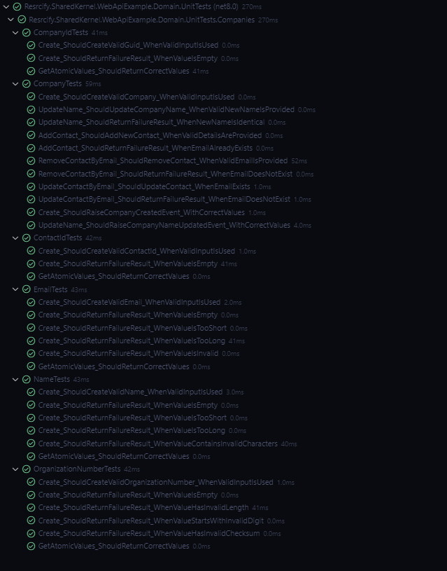

**Result**: Pass

### Architectural Tests
**Description**: Automated unit tests were performed for the the non-functioanl requirement that the codebase should follow Clean Architecture.

**Overview of testing**:

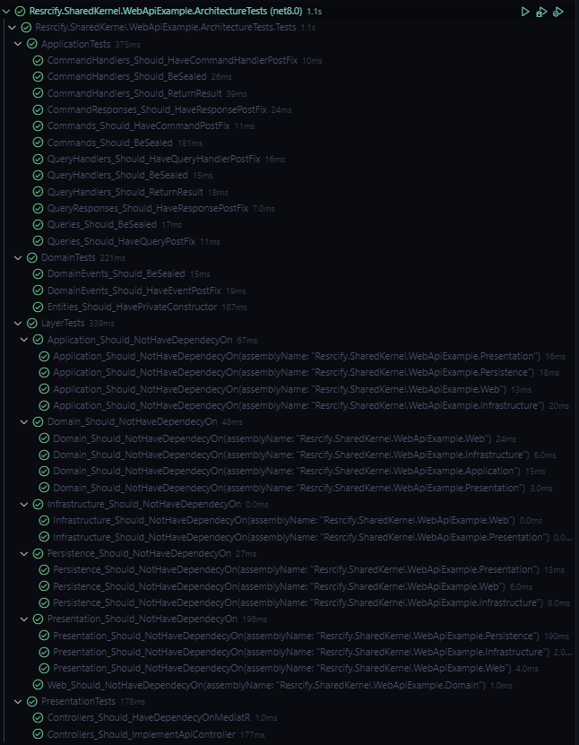

**Result**: Pass

### Manual Tests
#### Get All Companies
**Description**: Inspection was performed using Swagger and comparing to the data to the database.

**Evidence**:

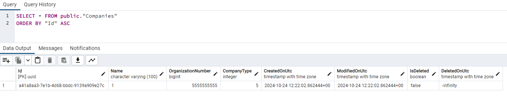
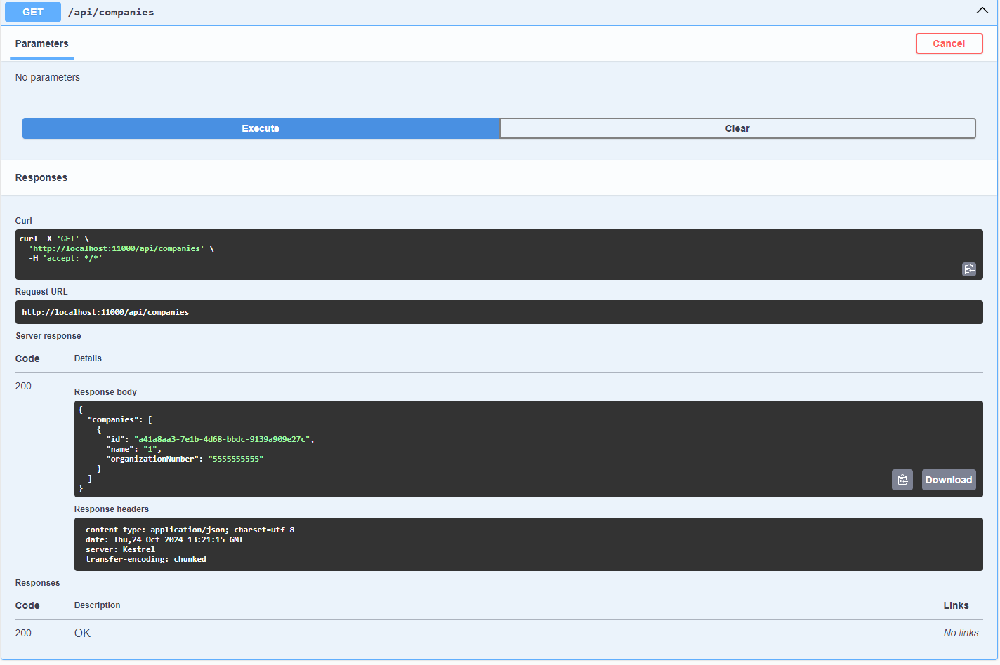

**Result**: Pass

#### Get Company By Id
**Description**: Inspection was performed using Swagger and comparing to the data to the database.

**Evidence**:


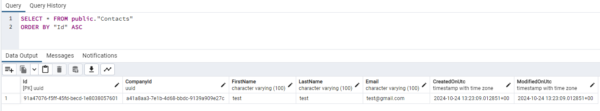
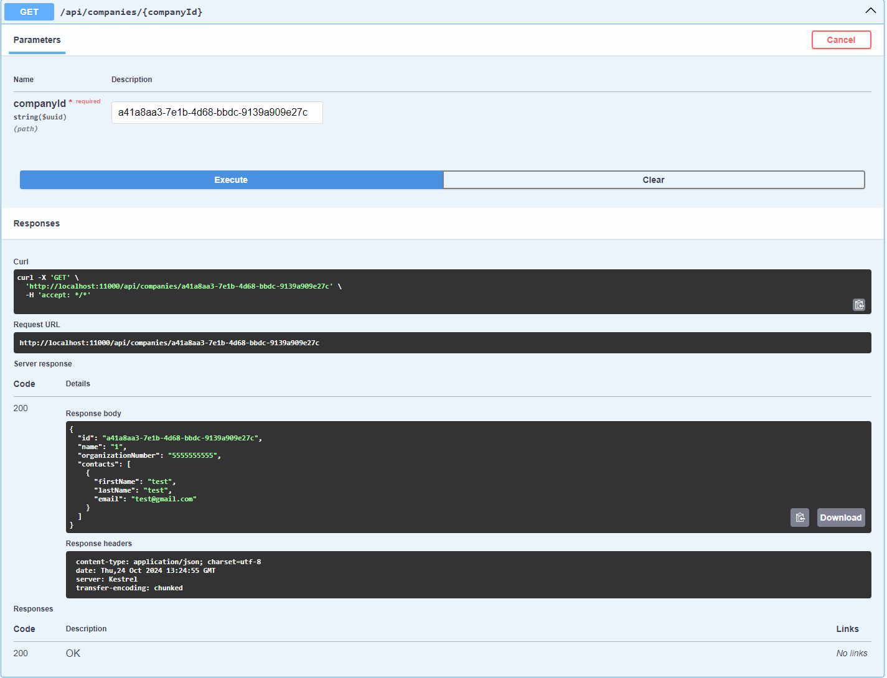

**Result**: Pass

#### Create a Company
**Expectation**: If organizational number already exist, should return a failure result.

**Description**: Inspection was performed using Swagger and comparing to the data to the database.

**Evidence**:


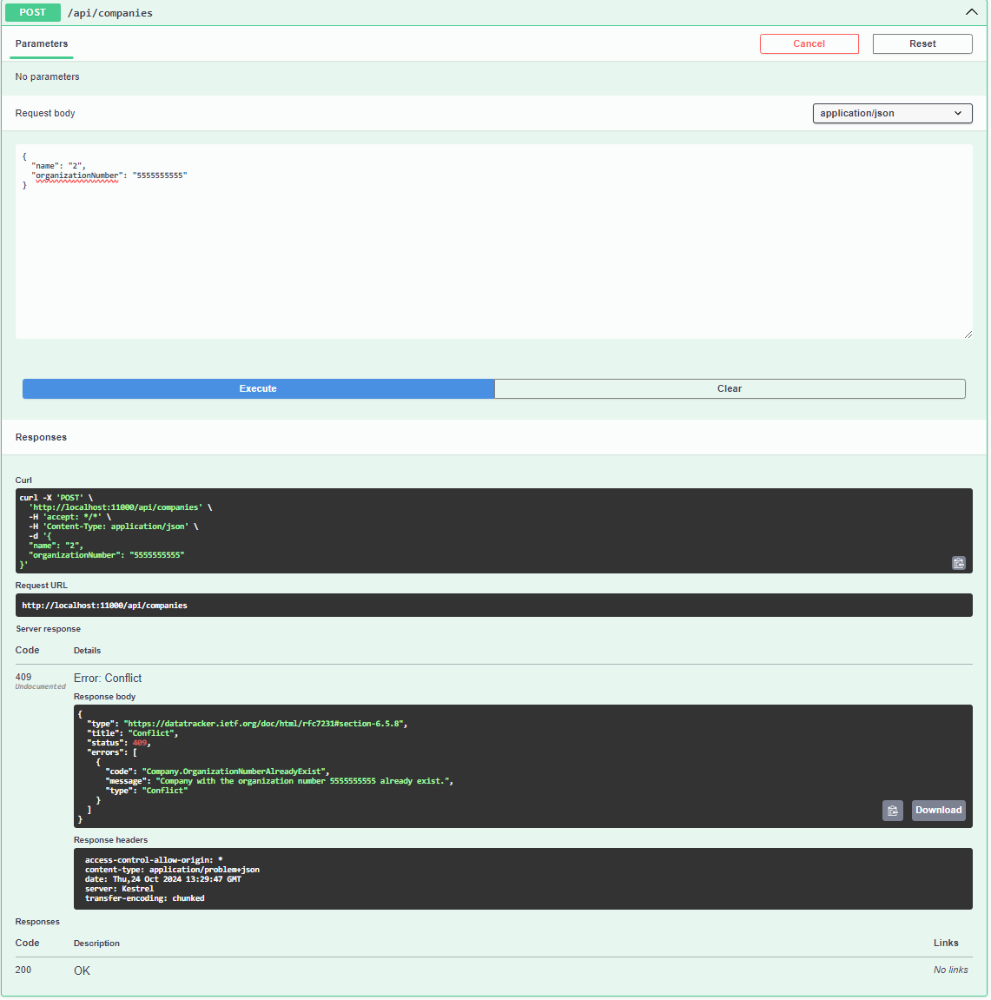

**Result**: Pass

#### Update a Company's Name
**Expectation**: If company doesn't exist, should return a failure result.

**Description**: Inspection was performed using Swagger and comparing to the data to the database.

**Evidence**:


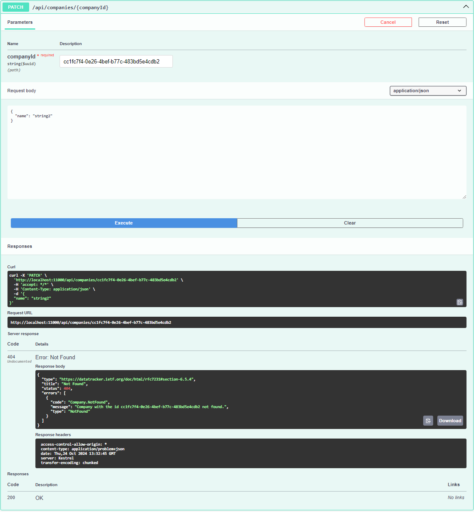

**Result**: Pass

#### Create a Contact
**Expectation**: If company doesn't exist, should return a failure result.

**Description**: Inspection was performed using Swagger and comparing to the data to the database.

**Evidence**:


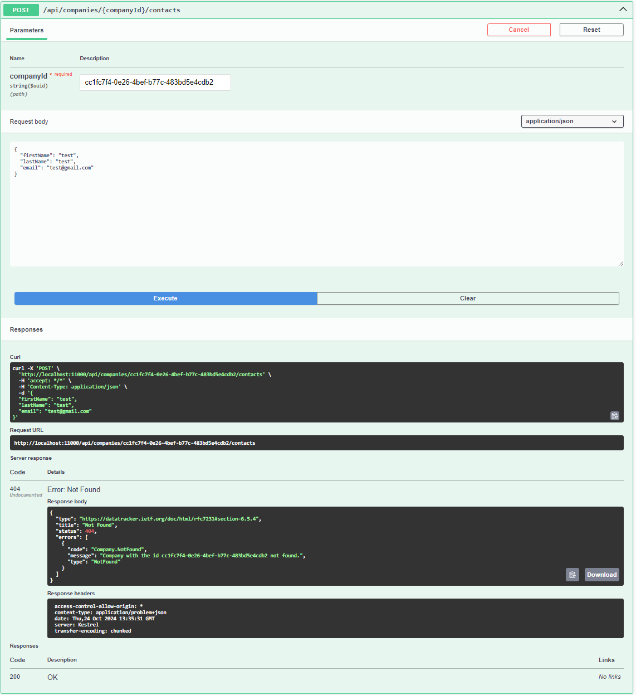

**Result**: Pass

#### Remove a Contact by Email
**Expectation**: If company doesn't exist, should return a failure result.

**Description**: Inspection was performed using Swagger and comparing to the data to the database.

**Evidence**:


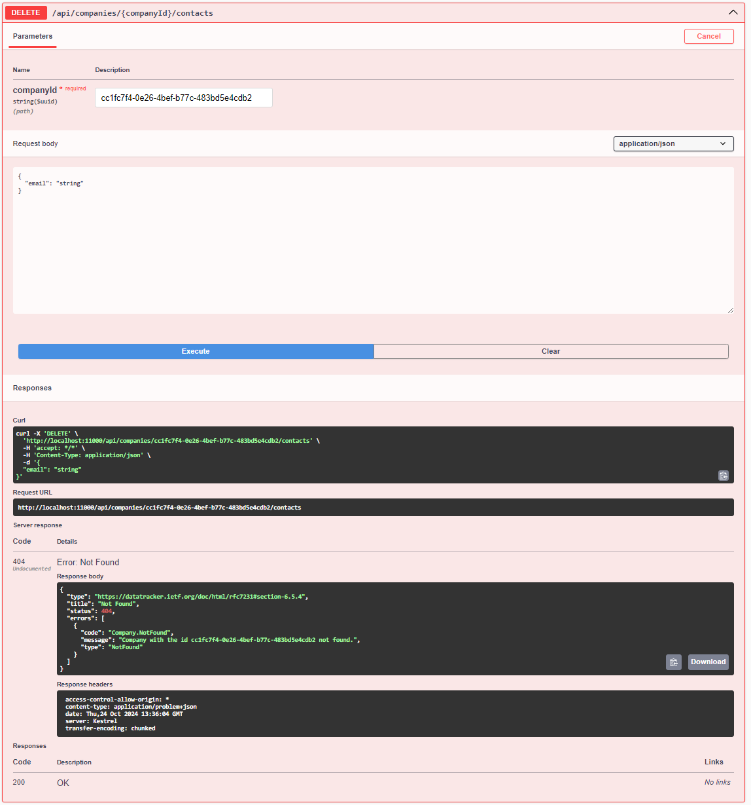

**Result**: Pass

#### Update a Contact by Email
**Expectation**: If company doesn't exist, should return a failure result.

**Description**: Inspection was performed using Swagger and comparing to the data to the database.

**Evidence**:

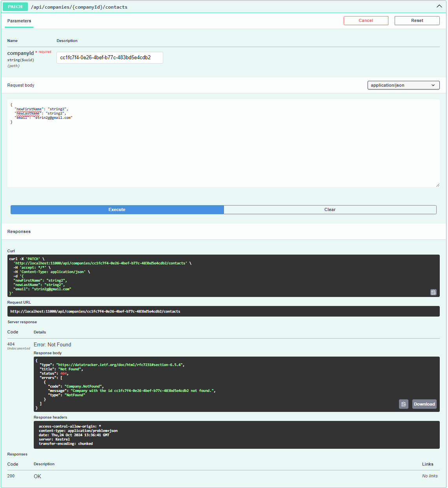

**Result**: Pass

#### Send an Event on Company Creation
**Expectation**: When company has been created should send out an Event.

**Description**: Inspection was performed using Swagger and monitoring logs.

**Evidence**:

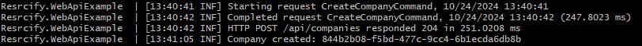

**Result**: Pass

#### Send an Event on Company Name Change
**Expectation**: When company has been created should send out an Event.

**Description**: Inspection was performed using Swagger and monitoring logs.

**Evidence**:

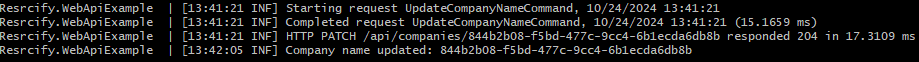

**Result**: Pass

#### Caching of Queries
**Expectation**: After the first query should save the response to cache and conccurent responses should be sent from the cache instead of the database. Cache should be invalidated after five minutes.

**Description**: Inspection was performed using Swagger and monitoring logs.

**Evidence**:

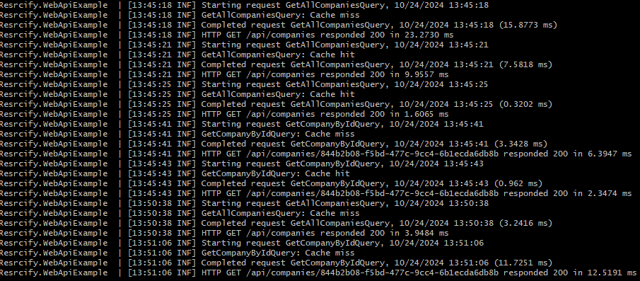

**Result**: Pass

#### Domain Driven Design
**Description**: Inspection was performed in the domain layer of this project [Features](src/Resrcify.SharedKernel.WebApiExample.Domain/Features/). It was noticed that all relevant domain ojects implemented one of the following Domain Driven Design base classes:
- Aggregate Root
- Entity
- Value Object
- Domain Event
- Enumeration

**Result**: Pass

#### Result Pattern
**Description**: Inspection was performed in the [Domain](src/Resrcify.SharedKernel.WebApiExample.Domain/Features/) and [Application](src/Resrcify.SharedKernel.WebApiExample.Application/Features/) layers of this project . It was noticed that all relevant classes has a return type of an Result or Result<T>.

**Result**: Pass